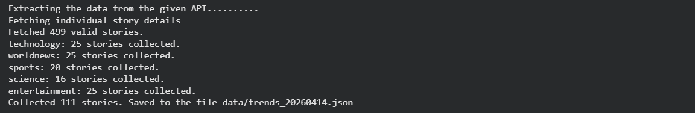
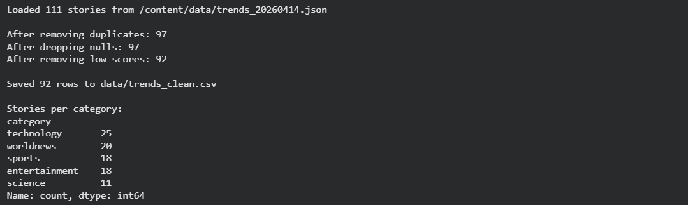
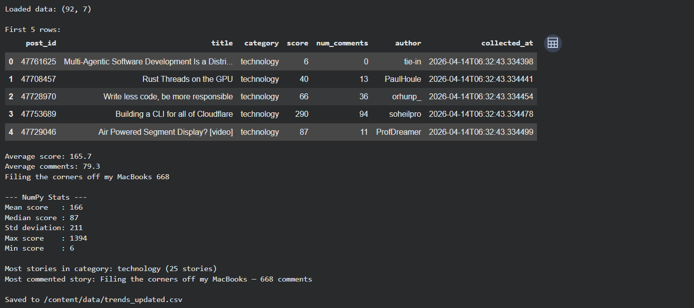
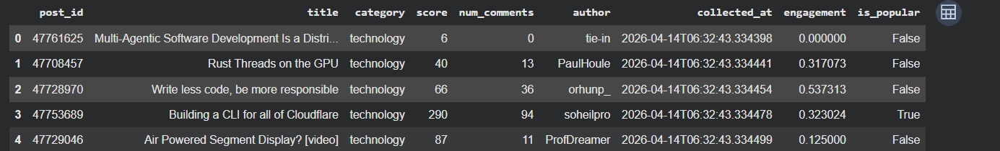
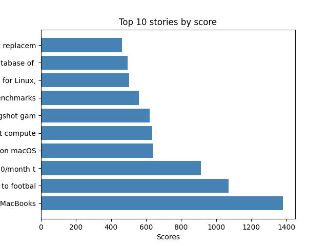
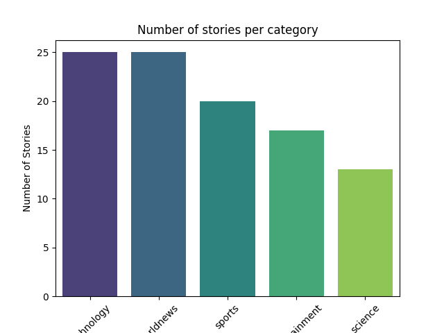
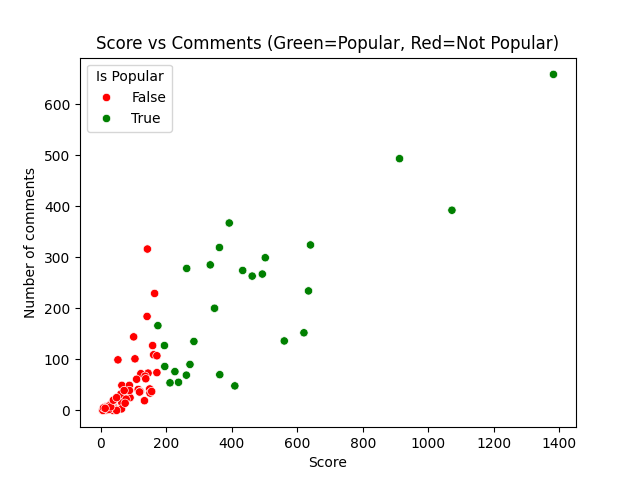
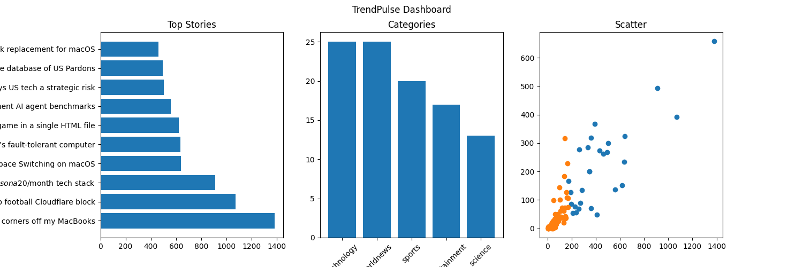

# TrendPulse

TrendPulse is a Python-based data pipeline project designed to collect, clean, analyze, and visualize top trending stories from Hacker News. It automatically categorizes real-world data, applies statistical analysis, and renders insightful visualizations to discover trends and engagement patterns.

## Project Structure

The project pipeline is divided into four distinct stages, sequentially executed in their respective Python scripts:

### 1. Data Collection (`task1_data_collection.py`)
- Hooks into the Hacker News API to fetch the top 500 current trending stories.
- Extracts details such as the story ID, title, score, number of comments, and author.
- Categorizes stories into one of five predefined categories (Technology, Worldnews, Sports, Science, Entertainment) by identifying specific keywords hidden within story titles.
- Limits the collection to a maximum of 25 stories per category to maintain quota distribution.
- Exports the gathered information into a JSON file stored in the `data/` folder, stamped with the current date (e.g., `trends_YYYYMMDD.json`).

### 2. Data Preprocessing (`task2_data_preprocessing.py`)
- Loads the raw JSON file generated in Task 1 into a `pandas` DataFrame.
- Performs extensive data cleaning:
  - Sifts out any duplicate entries.
  - Removes rows missing essential values like ID, title, or score.
  - Casts appropriate numeric data types for fields handling scores and comment tallies.
  - Filters out overall underperforming stories (keeping only those with a minimum base score of 5).
  - Trims any lingering whitespace characters from categorical strings.
- Saves the clean, processed dataframe output to `data/trends_clean.csv`.

### 3. Data Analysis (`task3_analysis.py`)
- Reads the cleaned CSV dataset and applies fundamental calculations utilizing `numpy` and `pandas`.
- Prints basic operational statistics, such as determining the mean, median, stdev, maximum, and minimum values of trending scores.
- Extracts deeper statistical summaries, querying data for insights like "the category with the most stories," and "the most commented-on individual story."
- Engineers and attaches new features to the existing columns:
  - **`engagement`**: Derived logic showcasing the ratio of comments against the story's score.
  - **`is_popular`**: A boolean flag emphasizing if the story surpasses the calculated average score line.
- Outputs the augmented, detailed dataset for final render processing. 

### 4. Data Visualization (`task4_visualization.py`)
- Uses `matplotlib` and `seaborn` to import the analyzed `.csv` output files and transform raw numbers into comprehensible visual stories.
- Generates several static graphic outputs:
  - A horizontal bar chart mapping the Top 10 longest active trending stories by score.
  - A vertical bar chart revealing the distribution of stories against the 5 established categories.
  - A multi-colored Scatter Plot mapping "Score versus Comments", utilizing hue layers to easily expose popular/not-popular patterns.
  - A holistic Subplot Dashboard merging all visualizations simultaneously onto one canvas surface.
- Automatically saves all created PNG visual assets strictly to the `outputs/` root directory.

## Installation and Usage

1. Create a virtual environment or ensure you're on a clean workspace. 
2. Install the necessary dependencies specified within the `requirements.txt` file (typically using `pip install -r requirements.txt`). Dependencies primarily include `requests`, `pandas`, `numpy`, `matplotlib`, and `seaborn`.
3. To trigger the full pipeline workflow, simply run the Python scripts consecutively in order from Task 1 through Task 4.
